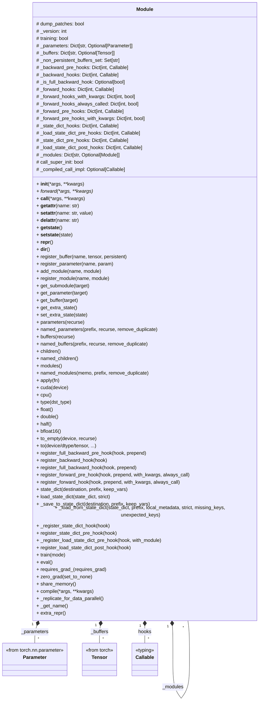
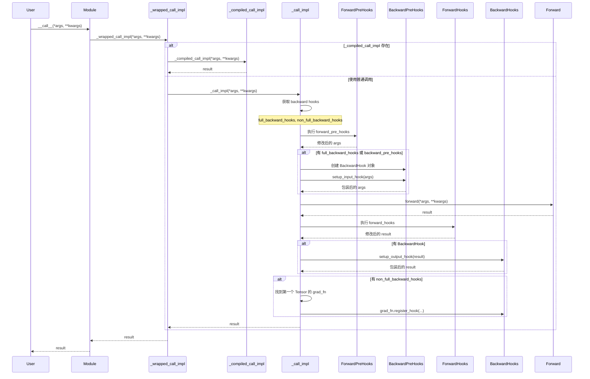

# nn.Module

PyTorch表示模型的核心数据结构是`nn.Module`，位于`torch/nn/modules/module.py`，其类图如下：



## 核心属性

1. `training`：表示当前module是否处于训练状态，可以通过`train()`/`eval()`方法切换状态。

2. `_buffers`：`OrderedDict[str, Optional[Tensor]]`，用于保存模型临时活中构建变量(`Tenosr`)，例如`BatchNorm`这个module的running_mean和running_std，可以通过`resiger_buffers`方法为module添加buffer。

3. `_parameters`：`OrderedDict[str, Optional[Parameter]]`，模型真正的参数，可以通过`register_parameters`方法为module添加parameter。

4. 一堆hook：钩子回调函数，用户可以利用这些钩子对模型进行观察或者修改。例如forward_hook可以在函数前向推理过程中打印一些变量，backward_hook可以在反向传播过程中观察梯度变化，state_dict_hook可以在模型加载的时候调用。
   
   ```python
   _forward_pre_hooks: dict[int, Callable]   # 前向传播前钩子
   _forward_hooks: dict[int, Callable]   # 前向传播后钩子
   _backward_pre_hooks: dict[int, Callable] # 反向传播前钩子
   _backward_hooks: dict[int, Callable]  # 反向传播后钩子
   _state_dict_hooks: dict[int, Callable]  # 状态字典钩子
   _load_state_dict_pre_hooks: dict[int, Callable]  # 加载状态字典前钩子
   _load_state_dict_post_hooks: dict[int, Callable]  # 加载状态字典后钩子
   ```

## 核心方法

- `to`/`float`/`double`/`half`/`bfloat16`/`type`：这些方法会递归的将整个模型的parameter/buffer转成对应的数据类型，`to`方法会直接转换，，`type`需要传递转换后的数据类型。而`float`/`double`/`bfloat16`等会判断原始类型是浮点型才会转换，相当于安全转换，他们都是`_apply`方法的封装。

- `zero_grad`：将模型中的参数梯度清空，最终会调用`p.grad=None`如果`set_to_none=True`，否则调用`p.grad.zero_()`

- `train()/eval()`：设置当前属性`training`，并调用所有子模块的`train/eval`，从而设置整个模型状态。

- `cuda`/`cpu`/`xpu`/etc：将模型/以及子模型中的参数转到对应设备上。

- `apply`：入参为一个函数对象，该函数会将函数对象应用到所有parameter/buffer上，并调用子module的apply方法。

### 参数/缓冲区/模块访问

```python
paramters(recurse: bool = True) -> Iterator[Paramter]  # 返回所有参数的迭代器，recurse=True时递归访问子module

named_parameters(prefix='', recurse=True, remove_duplicate=True) # 返回 (name, parameter)元组的迭代器

buffers(recurse: bool = True) -> Iterator[Tensor]  # 返回所有缓冲区的迭代器

children() -> Iterator['Module'] # 返回直接子模块的迭代器（不递归）

modules() -> Iterator['Module']  # 返回所有模块的迭代器（包括自身，递归）

named_modules(memo=None, prefix='', remove_duplicate=True)  # 返回 `(name, module)` 元组的迭代器
```

### 钩子注册

- `register_forward_pre_hook(hook, prepend=False, with_kwargs=False, always_call=False)`
  
  ```python
  def hook(module, input):
      # 在前向传播前执行
      return modified_input
  
  module.register_forward_pre_hook(hook)
  ```

- `register_forward_hook(hook, prepend=False, with_kwargs=False, always_call=False)`
  
  ```python
  def hook(module, input, output):
      # 在前向传播后执行
      return modified_output
  
  module.register_forward_hook(hook)
  ```

- `register_full_backward_hook(hook, prepend=False)`
  
  ```python
  def hook(module, grad_input, grad_output):
      # 在反向传播后执行
      return modified_grad_input
  
  module.register_full_backward_hook(hook)
  ```

### 状态字典管理

- `state_dict(destination=None, prefix='', keep_vars=False)`：返回模块的状态字典，包含所有参数和持久化缓冲区

- `load_state_dict(state_dict, strict=True)`：从状态字典加载参数和缓冲区，`strict=True`时，key必须完全匹配

## `_modules` 属性

这是一个字典类型，`OrderedDict[str, Optional[Moduel]]`，通过`_modules`对象，一个模型就可以表示为树状结构，每个节点都都是`module`对象，每个节点都可以由多个子节点。

```python
class Net(nn.Module):
    def __init__(self, in_features, out_features):
        super().__init__()
        self.mlp = nn.Linear(in_features, out_features)
        self.relu = nn.ReLU()

    def forward(self, x):
        x = self.mlp(x)
        x = self.relu(x)
        return x
```

这里定义了一个`Net`网络，在初始化方法中定义了`self.mlp`属性为`nn.Linear`。这里的`nn.Linear`是一个`Module`的子类，如此定义后`nn.Linear`就是`Net`的子module，具体是通过`__setattr__`的来实现：

```python
def __setattr__(self, name: str, value: Union[Tensor, Module]) -> None:
    ...

    modules = self.__dict__.get("_moduels")
    if isinstance(value, Moudle):
        if modules is None:
            raise AttributeError(
                "cannot assign module before Module.__init__() call")
        remove_from(self.__dict__, self._parameters, self._buffers, self._non_persistent_buffers_set)
        for hook in _global_module_registration_hooks.values():
            output = hook(self, name, value)
            if output is not None:
                value = output
        modules[name] = value
```

当设置属性是，如果对象是`Module`类型，则会被添加进`_modules`字典，整个模型通过这种方式被组织成一个树状结构。

## 前向传播流程



## hook的一些用法

`modules.py`还提供了一组全局hook注册接口，可以方便地实现整网数据抓取：

```
register_module_forward_pre_hook: called every time before :func:`forward` is invoked.
register_module_forward_hook: called every time after :func:`forward` has computed an output.
register_module_full_backward_pre_hook: called every time before gradients for a module are computed.
register_module_full_backward_hook: called every time after gradients for a module are computed.
```

```python
import torch
import torch.nn as nn
import traceback
import threading
from collections import defaultdict
from typing import Dict, List, Any, Optional, Tuple
from torch.nn.modules.module import (
    register_module_forward_hook,
    register_module_full_backward_hook,
)
from torch.utils.hooks import RemovableHandle


class ModuleDataCollector:
    """模块数据收集器"""

    def __init__(self):
        # 全局唯一ID生成器
        self._global_id_counter = 0
        self._lock = threading.Lock()

        # 模块ID映射：module_id -> global_id
        self._module_to_global_id: Dict[int, int] = {}

        # 存储所有收集的数据
        self.forward_data: List[Dict[str, Any]] = []
        self.backward_data: List[Dict[str, Any]] = []

        # 模块信息缓存
        self._module_info_cache: Dict[int, Dict[str, Any]] = {}

    def get_global_id(self, module: nn.Module) -> int:
        """获取模块的全局唯一ID"""
        module_id = id(module)

        if module_id not in self._module_to_global_id:
            with self._lock:
                if module_id not in self._module_to_global_id:
                    self._global_id_counter += 1
                    self._module_to_global_id[module_id] = self._global_id_counter

                    # 缓存模块信息
                    self._module_info_cache[module_id] = {
                        'global_id': self._global_id_counter,
                        'module_type': type(module).__name__,
                        'module_class': type(module).__module__ + '.' + type(module).__name__,
                    }

        return self._module_to_global_id[module_id]

    def get_call_stack(self, depth: int = 15) -> List[str]:
        """获取调用栈信息"""
        stack = traceback.extract_stack()
        # 排除钩子相关的栈帧
        # 从后往前找，排除：get_call_stack, collect_forward/backward_data, forward/backward_hook
        filtered_stack = []
        skip_functions = ['get_call_stack', 'collect_forward_data', 'collect_backward_data', 
                         'forward_hook', 'backward_hook', '_call_impl', '_wrapped_call_impl']

        for frame in stack:
            # 跳过钩子相关的函数
            if frame.name not in skip_functions:
                filtered_stack.append(frame)

        # 只保留最后depth层
        filtered_stack = filtered_stack[-depth:] if len(filtered_stack) > depth else filtered_stack

        call_stack = []
        for frame in filtered_stack:
            # 提取文件名（只保留最后部分）
            filename = frame.filename.split('/')[-1] if '/' in frame.filename else frame.filename
            filename = filename.split('\\')[-1] if '\\' in filename else filename
            # 格式：文件名:行号 in 函数名
            call_info = f"{filename}:{frame.lineno} in {frame.name}"
            call_stack.append(call_info)

        return call_stack

    def extract_tensor_info(self, tensor: torch.Tensor) -> Dict[str, Any]:
        """提取tensor的统计信息"""
        if tensor is None:
            return None

        if not isinstance(tensor, torch.Tensor):
            return {'type': str(type(tensor)), 'is_tensor': False}

        return {
            'is_tensor': True,
            'shape': list(tensor.shape),
            'dtype': str(tensor.dtype),
            'device': str(tensor.device),
            'requires_grad': tensor.requires_grad,
            'mean': tensor.mean().item() if tensor.numel() > 0 else 0.0,
            'max': tensor.max().item() if tensor.numel() > 0 else 0.0,
            'min': tensor.min().item() if tensor.numel() > 0 else 0.0,
            'std': tensor.std().item() if tensor.numel() > 0 else 0.0,
            'numel': tensor.numel(),
        }

    def extract_input_output(self, data: Any) -> List[Dict[str, Any]]:
        """提取输入或输出的tensor信息"""
        if data is None:
            return []

        if isinstance(data, torch.Tensor):
            info = self.extract_tensor_info(data)
            return [info] if info else []

        if isinstance(data, (tuple, list)):
            result = []
            for item in data:
                if isinstance(item, torch.Tensor):
                    info = self.extract_tensor_info(item)
                    if info:
                        result.append(info)
                elif isinstance(item, (tuple, list)):
                    result.extend(self.extract_input_output(item))
            return result

        return []

    def collect_forward_data(self, module: nn.Module, input: Any, output: Any):
        """收集前向传播数据"""
        global_id = self.get_global_id(module)
        module_id = id(module)
        module_info = self._module_info_cache[module_id]
        call_stack = self.get_call_stack()

        # 提取输入输出信息
        input_info = self.extract_input_output(input)
        output_info = self.extract_input_output(output)

        # 构建唯一标识：global_id + module类型 + 算子名 + 调用栈哈希
        call_stack_hash = hash(tuple(call_stack[:3])) if call_stack else 0
        unique_id = f"gid_{global_id}_{module_info['module_type']}_{module_info['module_class']}_stack{abs(call_stack_hash) % 10000}"

        data = {
            'unique_id': unique_id,
            'global_id': global_id,
            'module_type': module_info['module_type'],
            'module_class': module_info['module_class'],
            'operator_name': module_info['module_type'],  # 算子名就是模块类型名
            'call_stack': call_stack,
            'input': input_info,
            'output': output_info,
            'timestamp': torch.cuda.Event().query() if torch.cuda.is_available() else None,
        }

        self.forward_data.append(data)

    def collect_backward_data(self, module: nn.Module, grad_input: Any, grad_output: Any):
        """收集反向传播数据"""
        global_id = self.get_global_id(module)
        module_id = id(module)
        module_info = self._module_info_cache[module_id]
        call_stack = self.get_call_stack()

        # 提取梯度信息
        grad_input_info = self.extract_input_output(grad_input)
        grad_output_info = self.extract_input_output(grad_output)

        # 构建唯一标识：global_id + module类型 + 算子名 + 调用栈哈希
        call_stack_hash = hash(tuple(call_stack[:3])) if call_stack else 0
        unique_id = f"gid_{global_id}_{module_info['module_type']}_{module_info['module_class']}_stack{abs(call_stack_hash) % 10000}"

        data = {
            'unique_id': unique_id,
            'global_id': global_id,
            'module_type': module_info['module_type'],
            'module_class': module_info['module_class'],
            'operator_name': module_info['module_type'],
            'call_stack': call_stack,
            'grad_input': grad_input_info,
            'grad_output': grad_output_info,
            'timestamp': torch.cuda.Event().query() if torch.cuda.is_available() else None,
        }

        self.backward_data.append(data)

    def print_summary(self):
        """打印收集的数据摘要"""
        print("=" * 80)
        print("数据收集摘要")
        print("=" * 80)
        print(f"前向传播数据条数: {len(self.forward_data)}")
        print(f"反向传播数据条数: {len(self.backward_data)}")
        print(f"唯一模块数量: {len(self._module_to_global_id)}")
        print()

        # 按模块类型统计
        forward_stats = defaultdict(int)
        backward_stats = defaultdict(int)

        for data in self.forward_data:
            forward_stats[data['module_type']] += 1

        for data in self.backward_data:
            backward_stats[data['module_type']] += 1

        print("前向传播模块类型统计:")
        for module_type, count in sorted(forward_stats.items()):
            print(f"  {module_type}: {count}")

        print("\n反向传播模块类型统计:")
        for module_type, count in sorted(backward_stats.items()):
            print(f"  {module_type}: {count}")

    def print_detailed_data(self, limit: Optional[int] = None):
        """打印详细数据"""
        print("=" * 80)
        print("前向传播详细数据")
        print("=" * 80)

        for i, data in enumerate(self.forward_data[:limit] if limit else self.forward_data):
            print(f"\n[{i+1}] {data['unique_id']}")
            print(f"  Global ID: {data['global_id']}")
            print(f"  模块类型: {data['module_type']}")
            print(f"  算子名: {data['operator_name']}")
            print(f"  调用栈:")
            for j, stack_frame in enumerate(data['call_stack'][-5:]):  # 只显示最后5层
                print(f"    [{j+1}] {stack_frame}")
            print(f"  输入数量: {len(data['input'])}")
            for j, inp in enumerate(data['input']):
                if inp and inp.get('is_tensor'):
                    print(f"    Input[{j}]: shape={inp['shape']}, mean={inp['mean']:.6f}, "
                          f"max={inp['max']:.6f}, min={inp['min']:.6f}")
            print(f"  输出数量: {len(data['output'])}")
            for j, out in enumerate(data['output']):
                if out and out.get('is_tensor'):
                    print(f"    Output[{j}]: shape={out['shape']}, mean={out['mean']:.6f}, "
                          f"max={out['max']:.6f}, min={out['min']:.6f}")

        print("\n" + "=" * 80)
        print("反向传播详细数据")
        print("=" * 80)

        for i, data in enumerate(self.backward_data[:limit] if limit else self.backward_data):
            print(f"\n[{i+1}] {data['unique_id']}")
            print(f"  Global ID: {data['global_id']}")
            print(f"  模块类型: {data['module_type']}")
            print(f"  算子名: {data['operator_name']}")
            print(f"  调用栈:")
            for j, stack_frame in enumerate(data['call_stack'][-5:]):  # 只显示最后5层
                print(f"    [{j+1}] {stack_frame}")
            print(f"  输入梯度数量: {len(data['grad_input'])}")
            for j, grad_in in enumerate(data['grad_input']):
                if grad_in and grad_in.get('is_tensor'):
                    print(f"    Grad Input[{j}]: shape={grad_in['shape']}, mean={grad_in['mean']:.6f}, "
                          f"max={grad_in['max']:.6f}, min={grad_in['min']:.6f}")
            print(f"  输出梯度数量: {len(data['grad_output'])}")
            for j, grad_out in enumerate(data['grad_output']):
                if grad_out and grad_out.get('is_tensor'):
                    print(f"    Grad Output[{j}]: shape={grad_out['shape']}, mean={grad_out['mean']:.6f}, "
                          f"max={grad_out['max']:.6f}, min={grad_out['min']:.6f}")

    def export_to_dict(self) -> Dict[str, Any]:
        """导出所有数据为字典"""
        return {
            'forward_data': self.forward_data,
            'backward_data': self.backward_data,
            'module_mapping': {
                str(module_id): global_id 
                for module_id, global_id in self._module_to_global_id.items()
            },
            'summary': {
                'total_forward_records': len(self.forward_data),
                'total_backward_records': len(self.backward_data),
                'unique_modules': len(self._module_to_global_id),
            }
        }


# 全局数据收集器实例
_collector = ModuleDataCollector()


def forward_hook(module: nn.Module, input: Any, output: Any):
    """前向传播钩子"""
    _collector.collect_forward_data(module, input, output)


def backward_hook(module: nn.Module, grad_input: Any, grad_output: Any):
    """反向传播钩子"""
    _collector.collect_backward_data(module, grad_input, grad_output)
    return None  # 不修改梯度

register_module_forward_hook(forward_hook)
register_module_full_backward_hook(backward_hook)
```
